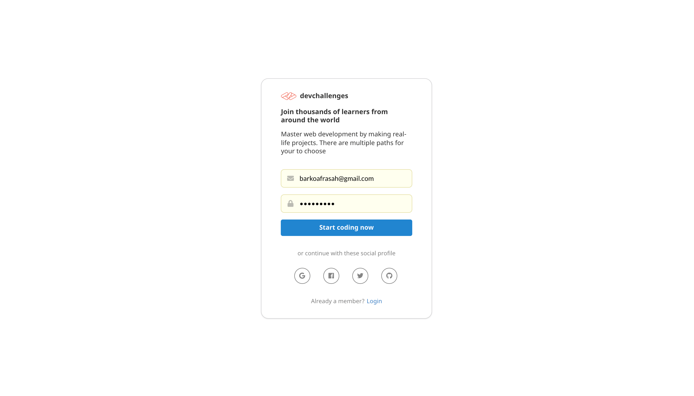
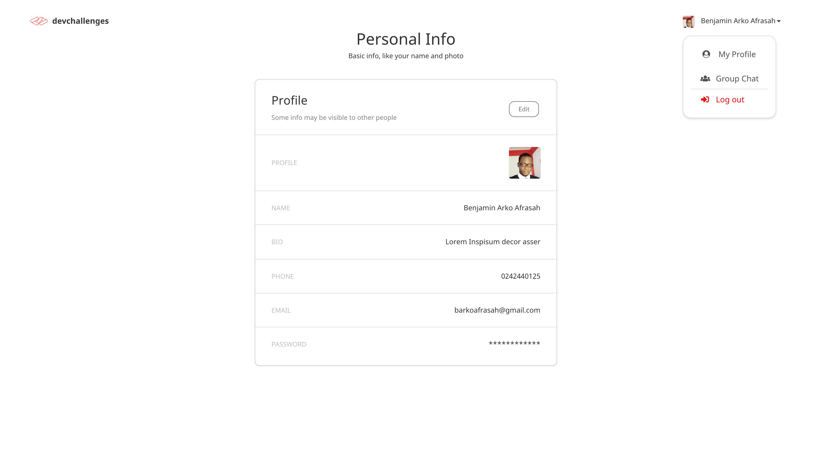
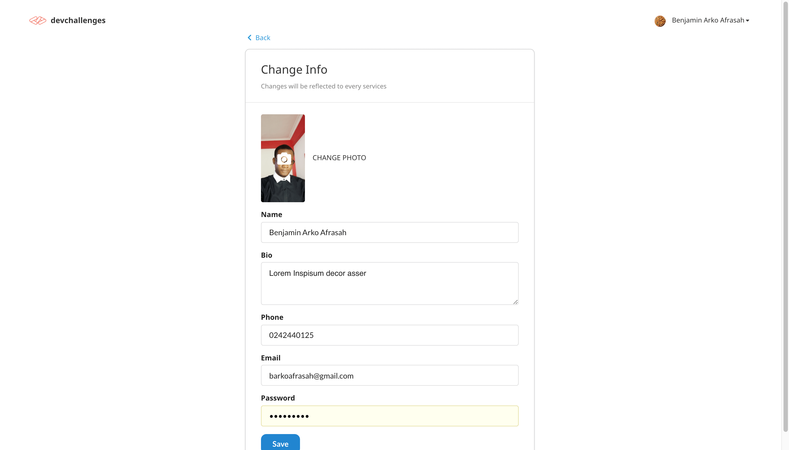
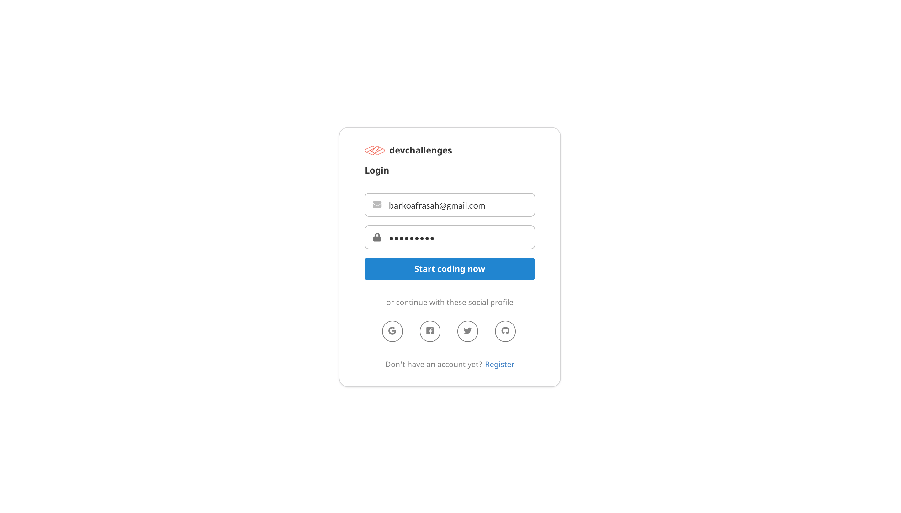

<!-- Please update value in the {}  -->

<h1 align="center">Benjamin Arko Afrasah Coding Challenge</h1>

<div align="center">
   Solution for a challenge from  <a href="https://investondaba.notion.site/Fullstack-Intermediate-Test-2-c911eab2a18446d4a87eb5ca938f13ad" target="_blank">daba full stack intermediate coding exercise</a>.
</div>

<div align="center">
  <h3>
    <a href="https://benspace.netlify.app">
      Demo
    </a>
    <span> | </span>
    <a href="https://{your-url-to-the-solution}">
      Solution
    </a>
    <span> | </span>
    <a href="https://benspace.herokuapp.com/graphql">
      Backend
    </a>
  </h3>
</div>

<!-- TABLE OF CONTENTS -->

## Table of Contents

-   [Overview](#overview)
    -   [Built With](#built-with)
-   [Features](#features)
-   [How to use](#how-to-use)
-   [Contact](#contact)
-   [Acknowledgements](#acknowledgements)

<!-- OVERVIEW -->

## Overview

<span>




</span>

Introduce your projects by taking a screenshot, video recordings or a gif. Try to tell us about the solution you built by answering the following:

-   Where can I see your demo?
-   What was your experience building it.

### Built With

<!-- This section should list any major frameworks that you built your project using. Here are a few examples.-->

-   [React](https://reactjs.org/)
-   [Semantic UI React](https://react.semantic-ui.com/)
-   [Apollo GraphQL](https://www.apollographql.com/docs/apollo-server/)
-   [Express](https://expressjs.com/en/starter/installing.html)

## Features

<!-- List the features of your application or follow the template. Don't share the figma file here :) -->

What features did you develop?

## How To Use

<!-- Example: -->

To clone and run this application, you'll need [Git](https://git-scm.com) and [Node.js](https://nodejs.org/en/download/) (which comes with [npm](http://npmjs.com)) installed on your computer. From your command line:

```bash
# Clone this repository
$ git clone https://github.com/Silvrash/daba-fullstack-coding-exerciise.git
```

-   Goto [Readme.md](./backend/Readme) to setup the backend
-   Goto [Readme.md](./ui/Readme) to setup the frontend
